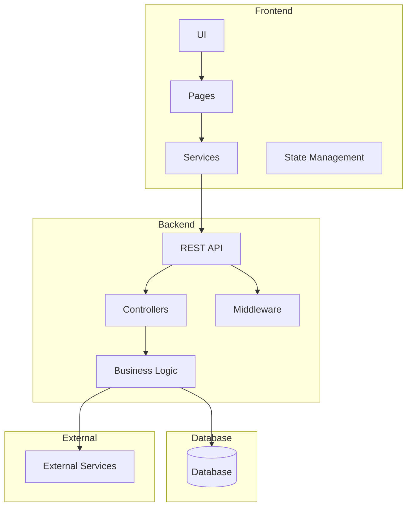
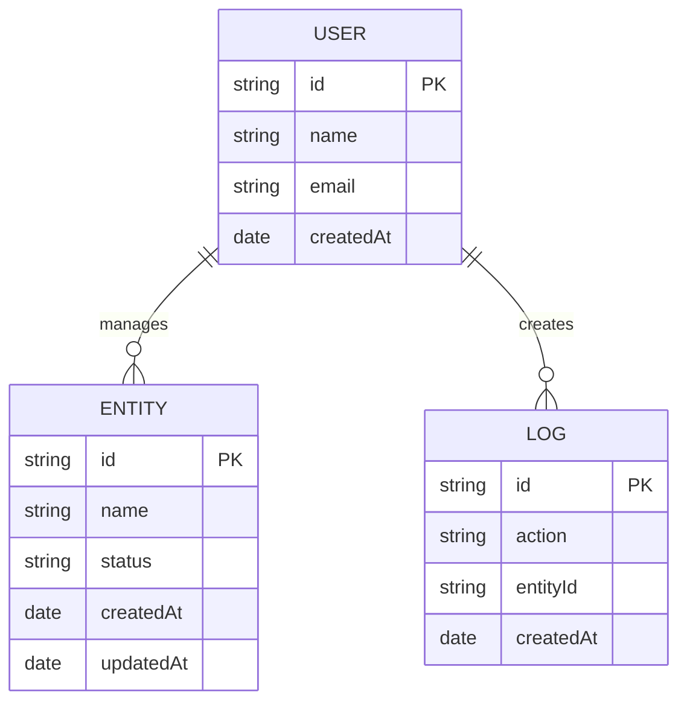

## System Architecture

```mermaid
graph TB
    subgraph Frontend
        UI[UI]
        Pages[Pages]
        Services[Services]
        State[State Management]
    end

    subgraph Backend
        API[REST API]
        Controllers[Controllers]
        Business[Business Logic]
        Middleware[Middleware]
    end

    subgraph Database
        DB[(Database)]
    end

    subgraph External
        ExternalServices[External Services]
    end

    UI --> Pages
    Pages --> Services
    Services --> API

    API --> Middleware
    API --> Controllers
    Controllers --> Business

    Business --> DB
    Business --> ExternalServices
```

## Database Model

```mermaid
erDiagram
    USER ||--o{ ENTITY : manages
    USER ||--o{ LOG : creates

    USER {
        string id PK
        string name
        string email
        date createdAt
    }

    ENTITY {
        string id PK
        string name
        string status
        date createdAt
        date updatedAt
    }

    LOG {
        string id PK
        string action
        string entityId
        date createdAt
    }
```
