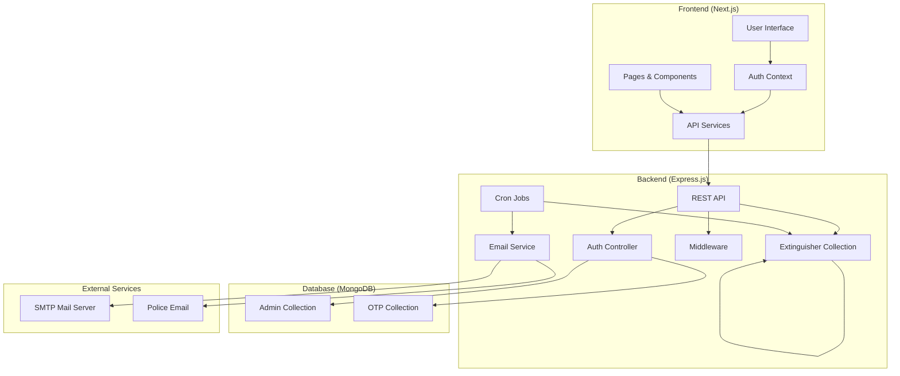
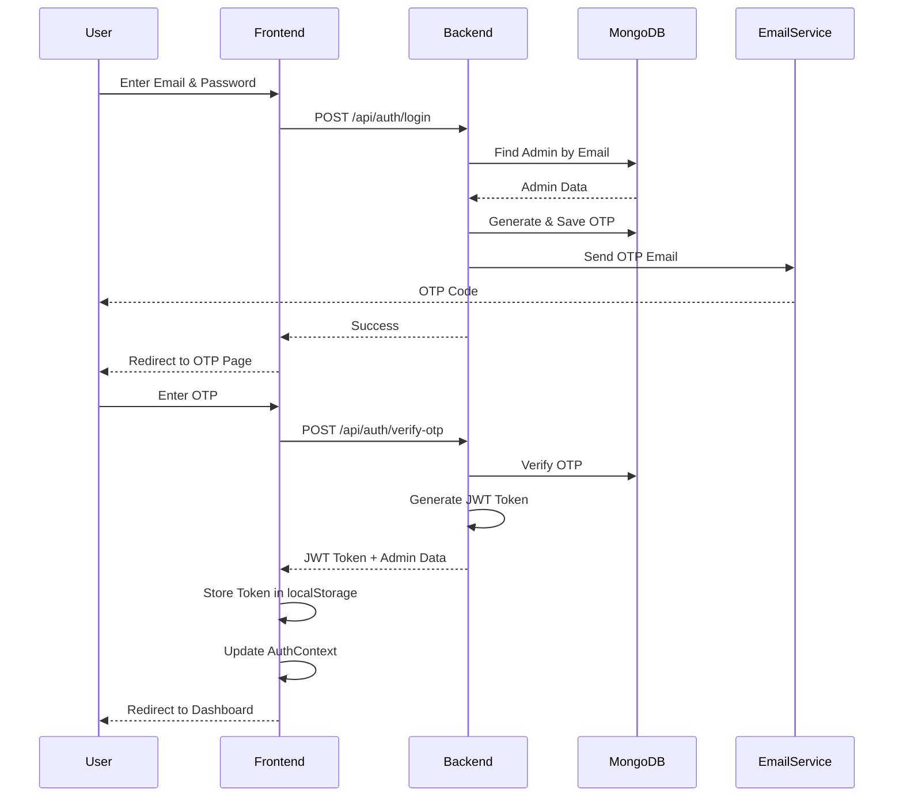
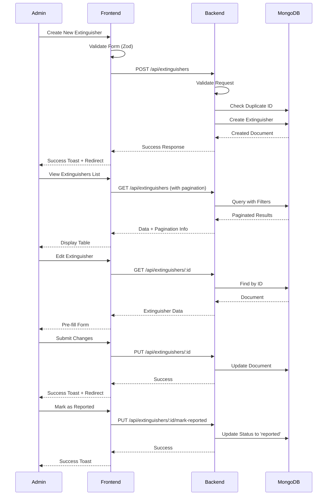
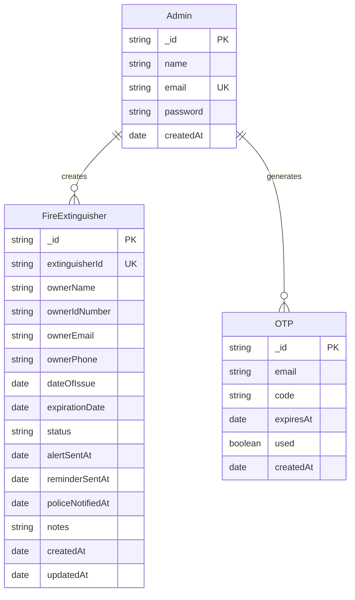
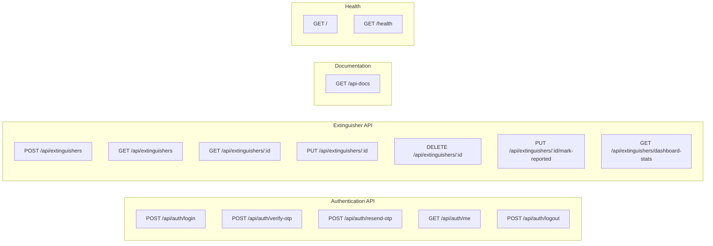
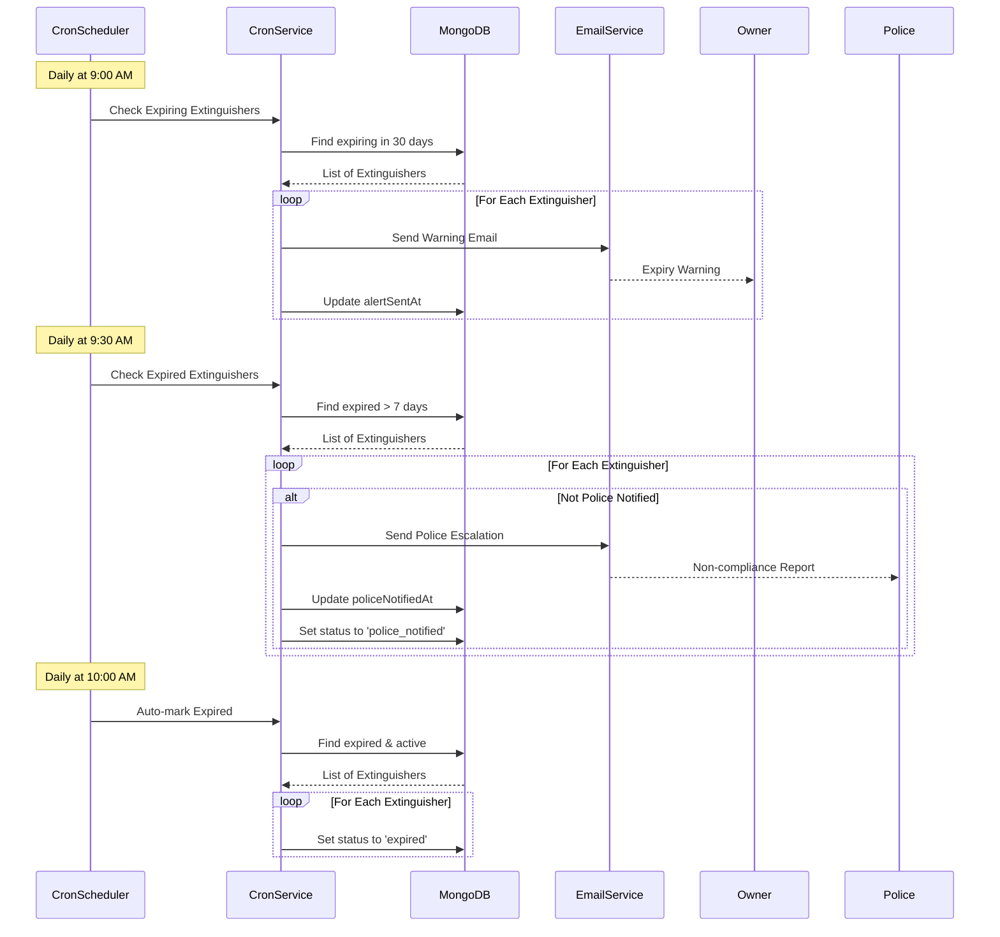
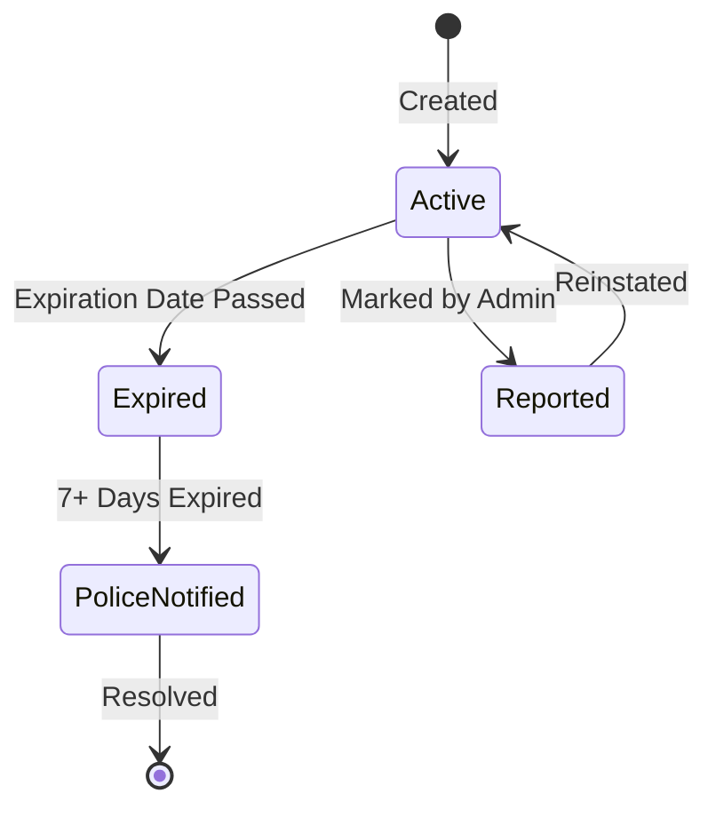

# Fire Extinguisher Management System - System Design

## Overview
A comprehensive system for managing fire extinguisher records with automated compliance tracking, expiry notifications, and police escalation for non-compliant owners.

## System Architecture



## Authentication Flow



## Extinguisher Management Flow



## Database Schema



## API Endpoints Structure



## Cron Job Workflow



## Frontend Component Structure

```mermaid
graph TB
    subgraph "Pages"
        Login[Login Page]
        VerifyOTP[Verify OTP Page]
        Dashboard[Dashboard Page]
        ExtinguishersList[Extinguishers List]
        ExtinguisherDetail[Extinguisher Detail]
        ExtinguisherNew[New Extinguisher]
        ExtinguisherEdit[Edit Extinguisher]
    end
    
    subgraph "Components"
        Button[Button]
        Input[Input]
        Textarea[Textarea]
        Modal[Modal]
        Badge[Badge]
        Pagination[Pagination]
        OtpInput[OTP Input]
        StatsCards[Stats Cards]
        ExtinguisherTable[Extinguisher Table]
        ExtinguisherForm[Extinguisher Form]
        Header[Header]
        Sidebar[Sidebar]
    end
    
    subgraph "Context & Hooks"
        AuthContext[Auth Context]
        useAuth[useAuth Hook]
        useDebounce[useDebounce Hook]
    end
    
    subgraph "Services"
        AuthService[Auth Service]
        ExtinguisherService[Extinguisher Service]
        DashboardService[Dashboard Service]
    end
    
    subgraph "Validations"
        LoginSchema[Login Schema]
        OtpSchema[OTP Schema]
        ExtinguisherSchema[Extinguisher Schema]
    end
    
    Login --> AuthService
    VerifyOTP --> AuthService
    Dashboard --> DashboardService
    Dashboard --> StatsCards
    ExtinguishersList --> ExtinguisherService
    ExtinguishersList --> ExtinguisherTable
    ExtinguishersList --> Pagination
    ExtinguisherDetail --> ExtinguisherService
    ExtinguisherNew --> ExtinguisherService
    ExtinguisherNew --> ExtinguisherForm
    ExtinguisherEdit --> ExtinguisherService
    ExtinguisherEdit --> ExtinguisherForm
    
    ExtinguisherForm --> ExtinguisherSchema
    Login --> LoginSchema
    VerifyOTP --> OtpSchema
    VerifyOTP --> OtpInput
    
    Dashboard --> useAuth
    ExtinguishersList --> useAuth
    ExtinguisherDetail --> useAuth
    ExtinguisherNew --> useAuth
    ExtinguisherEdit --> useAuth
    
    Header --> AuthContext
    Sidebar --> AuthContext
```



## Status Flow Diagram



## Technology Stack

### Backend
- **Runtime**: Node.js with TypeScript
- **Framework**: Express.js
- **Database**: MongoDB with Mongoose
- **Authentication**: JWT + OTP
- **Email**: Nodemailer
- **Validation**: express-validator
- **Documentation**: Swagger/OpenAPI
- **Scheduling**: node-cron
- **Security**: Helmet, CORS, Rate Limiting

### Frontend
- **Framework**: Next.js 16 with App Router
- **UI Library**: React 19
- **Styling**: TailwindCSS
- **Forms**: React Hook Form
- **Validation**: Zod
- **HTTP Client**: Axios
- **State Management**: React Context API
- **Notifications**: react-hot-toast
- **Type Safety**: TypeScript

## Environment Variables

### Backend (.env)
```
MONGODB_URI=mongodb://localhost:27017/fire-extinguisher
JWT_SECRET=your-secret-key
JWT_EXPIRES_IN=7d
MAIL_HOST=smtp.example.com
MAIL_PORT=587
MAIL_USER=your-email@example.com
MAIL_PASS=your-password
POLICE_EMAIL=police@example.com
ADMIN_EMAIL=admin@example.com
FRONTEND_URL=http://localhost:3000
PORT=5000
```

### Frontend (.env.local)
```
NEXT_PUBLIC_API_URL=http://localhost:5000
```

## Security Features

1. **Authentication**: JWT-based authentication with OTP verification
2. **Rate Limiting**: Login attempts limited to 5 per 15 minutes
3. **Input Validation**: Server-side validation with express-validator
4. **Client-side Validation**: Zod schemas for form validation
5. **CORS**: Configured to allow only frontend origin
6. **Helmet**: Security headers for Express
7. **Password Hashing**: Bcrypt for secure password storage
8. **Token Storage**: JWT tokens stored in localStorage with proper management

## Compliance Automation

1. **30-Day Warning**: Automatic email 30 days before expiry
2. **7-Day Reminder**: Follow-up reminder 7 days before expiry
3. **Police Escalation**: Automatic police notification 7 days after expiry
4. **Auto-Status Update**: Automatic status change to 'expired' when date passes
5. **Audit Trail**: Timestamps for all alerts and notifications

## Deployment Considerations

1. **Database**: Use MongoDB Atlas for production
2. **Email**: Use production SMTP service (SendGrid, AWS SES, etc.)
3. **Environment**: Separate configs for development/staging/production
4. **Monitoring**: Implement logging and monitoring (e.g., Winston, Sentry)
5. **Backup**: Regular database backups
6. **HTTPS**: SSL/TLS certificates for production
7. **Scaling**: Consider load balancing for high traffic
